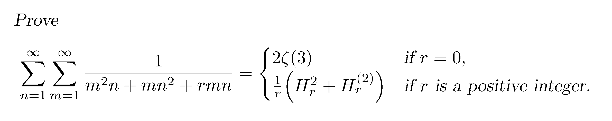

**题目来源: AMM Problem 12494 - J. Santmyer (USA).**

记 $\displaystyle S(r)=\sum_{n=1}^\infty\sum_{m=1}^\infty\frac{1}{mn(m+n+r)}$

### $r=0$ 时

注意到 $\displaystyle\frac{1}{t}=\int_0^1x^{t-1}\mathrm{d}x$, 代入得:

$$
\begin{aligned}
S(0)&=\sum_{n=1}^\infty\sum_{m=1}^\infty\frac{1}{mn}\int_0^1x^{m+n-1}\mathrm{d}x \\
&=\int_0^1\left(\sum_{n=1}^\infty\frac{x^n}{n}\right)\left(\sum_{m=1}^\infty\frac{x^m}{m}\right)\frac{1}{x}\mathrm{d}x \\
&=\int_0^1\frac{\ln^2(1-x)}{x}\mathrm{d}x
\end{aligned}
$$

令 $t=1-x$ 得:

$$
\begin{aligned}
S(0)&=\int_0^1\frac{\ln^2t}{1-t}\mathrm{d}t \\
&=\sum_{k=0}^\infty\int_0^1t^k\ln^2t\mathrm{d}t
\end{aligned}
$$

令 $u=-\ln t$, $t=e^{-u}$ 得:

$$
\begin{aligned}
S(0)&=\sum_{k=0}^\infty\int_0^\infty e^{-u(k+1)}u^2\mathrm{d}u \\
&=\sum_{k=0}^\infty\frac{\Gamma(3)}{(k+1)^3} \\
&=2\zeta(3)
\end{aligned}
$$

### $r\in\mathbb{Z}^+$ 时

同理得
$$S(r)=\int_0^1x^r\frac{\ln^2(1-x)}{x}\mathrm{d}x$$
令 $t=1-x$ 得:
$$S(r)=\int_0^1(1-t)^{r-1}\ln^2t\mathrm{d}t$$
观察 $B$ 函数:
$$B(a,b)=\int_0^1t^{a-1}(1-t)^{b-1}\mathrm{d}t=\frac{\Gamma(a)\Gamma(b)}{\Gamma(a+b)}$$
对 $a$ 求两次偏导:
$$\frac{\partial^2B}{\partial a^2}=\int_0^1t^{a-1}(1-t)^{b-1}\ln^2t\mathrm{d}t$$

可见 $a=1, b=r$ 是我们所需要的情况，接下来具体计算:

$$
\begin{aligned}
\frac{\partial\ln B}{\partial a}&=\psi(a)-\psi(a+b) \\
\frac{\partial B}{\partial a}&=B(a,b)\left[\psi(a)-\psi(a+b)\right] \\
\frac{\partial^2B}{\partial a^2}&=
\frac{\partial B}{\partial a}\left[\psi(a)-\psi(a+b)\right]+
B(a,b)\left[\psi'(a)-\psi'(a+b)\right] \\
&=B(a,b)\left\{\left[\psi(a)-\psi(a+b)\right]^2+\psi'(a)-\psi'(a+b)\right\} \\
S(r)&=B(1,r)\left\{\left[\psi(1)-\psi(r+1)\right]^2+\psi'(1)-\psi'(r+1)\right\}
\end{aligned}
$$

分开计算这几项:

$$B(1,r)=\frac{\Gamma(r)}{\Gamma(r+1)}=\frac{1}{r}$$

$$
\begin{aligned}
\psi(r+1)&=\frac{\Gamma'(r+1)}{\Gamma(r+1)} \\
&=\frac{\Gamma(r)+r\Gamma'(r)}{r\Gamma(r)} \\
&=\frac{1}{r}+\psi(r) \\
&=\dots \\
&=H_r+\psi(1)
\end{aligned}
$$

$$
\begin{aligned}
\psi'(r+1)&=\frac{\Gamma''(r+1)\Gamma(r+1)-(\Gamma'(r+1))^2}{\Gamma^2(r+1)} \\
&=\frac{\Gamma''(r+1)}{\Gamma(r+1)}-\psi^2(r+1) \\
&=\frac{\Gamma'(r)+\Gamma'(r)+r\Gamma''(r)}{r\Gamma(r)}-\frac{1}{r^2}-\frac{2\psi(r)}{r}-\psi^2(r) \\
&=\frac{\Gamma''(r)}{\Gamma(r)}-\frac{1}{r^2}-\psi^2(r) \\
&=\psi'(r)-\frac{1}{r^2} \\
&=\dots \\
&=\psi'(1)-H_r^{(2)}
\end{aligned}
$$

再代入回 $S(r)$ 得:

$$
\begin{aligned}
S(r)&=\frac{(-H_r)^2+H_r^{(2)}}{r}
&=\frac{H_r^2+H_r^{(2)}}{r}
\end{aligned}
$$

得证.