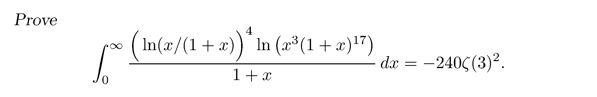

**题目来源: AMM Problem 12501 - H. Grandmontagne (France).**

### 初步化简

$$
\begin{aligned}
I &= \int_0^\infty{\frac{(\ln(x/(1+x)))^4\ln(x^3(1+x)^{17})}{1+x}}\mathrm{d}x \\
&= \int_0^\infty{\frac{(\ln\frac{x}{1+x})^4(3\ln x+17\ln(1+x))}{1+x}}\mathrm{d}x \\
\end{aligned}
$$

可以发现 $\displaystyle(\ln\frac{x}{1+x})^4$ 项不容易化简, 因此我们令 $\displaystyle t=\frac{x}{1+x}\in[0,1]$, 继续化简,

得到 $\displaystyle x=\frac{t}{1-t}$, 求导得 $\displaystyle\frac{\mathrm{d}x}{\mathrm{d}t}=\frac{\mathrm{d}}{\mathrm{d}t}(-1+\frac{1}{1-t})=\frac{1}{(1-t)^2}$, 代入得 $\displaystyle\frac{\mathrm{d}x}{1+x}=\frac{\mathrm{d}t}{1-t}$,

和 $3\ln x+17\ln(1+x)=3\ln t-3\ln(1-t)-17\ln(1-t)=3ln t-20ln(1-t)$.

因此原积分可以化简为

$$
\begin{aligned}
I &= 3\int_0^1{\frac{\ln^5t}{1-t}}\mathrm{d}t-20\int_0^1{\frac{\ln^4t\ln(1-t)}{1-t}}\mathrm{d}t \\
&= \boxed{3I_1-20I_2}
\end{aligned}
$$

我们分别计算 $I_1$ 和 $I_2$.

### 计算 $I_1$

 引理 $1$: $\displaystyle I=\int_0^1{t^k\ln^nt}\mathrm{d}t=(-1)^n\frac{\Gamma(n+1)}{(k+1)^{n+1}}$, 其中 $n\in\mathbb{Z}$ 

令 $\displaystyle u=-\ln t \in [0,+\infty)$, 则 $\displaystyle t=e^{-u}, \mathrm{d}t=-e^{-u}\mathrm{d}u$.

$$
\begin{aligned}
I &= \int_\infty^0 e^{-ku}(-u)^n(-e^{-u}\mathrm{d}u) \\
&= (-1)^n\int_0^\infty u^ne^{-(k+1)u}\mathrm{d}u \\
&= (-1)^n\frac{\Gamma(n+1)}{(k+1)^{n+1}} \\
\end{aligned}
$$

 引理 $2$: $\displaystyle I=\int_0^1{\frac{\ln^nt}{1-t}}\mathrm{d}t=(-1)^n\Gamma(n+1)\zeta(n+1)$, 其中 $n\in\mathbb{Z}$ 

$$
\begin{aligned}
I &= \int_0^1{\ln^nt\sum_{k=0}^\infty{t^k}}\mathrm{d}t \\
&= \sum_{k=0}^\infty\int_0^1{t^k\ln^nt}\mathrm{d}t \\
&= (-1)^n\sum_{k=0}^\infty\frac{\Gamma(n+1)}{(k+1)^{n+1}} \\
&= (-1)^n\Gamma(n+1)\zeta(n+1)
\end{aligned}
$$

引理 $2$ 代入 $n=5$ 得到 $\boxed{I_1=-120\zeta(6)}$.

### 计算 $I_2$

$$
\begin{aligned}
I_2 &= \int_0^1{\frac{\ln^4t}{1-t}\left(-\sum_{k=1}^\infty\frac{t^k}{k}\right)}\mathrm{d}t \\
&= -\sum_{k=1}^\infty\frac{1}{k}\int_0^1\frac{t^k\ln^4t}{1-t}\mathrm{d}t \\
&= -\sum_{k=1}^\infty\frac{1}{k}\sum_{n=0}^\infty\int_0^1t^{k+n}\ln^4t\mathrm{d}t \\
&= -24\sum_{k=1}^\infty\frac{1}{k}\sum_{n=0}^\infty\frac{1}{(k+n+1)^5} \\
&= -24\sum_{k=1}^\infty\sum_{n=0}^\infty\frac{1}{k(k+n+1)^5} \\
&= -24\sum_{k=1}^\infty\sum_{m=k}^\infty\frac{1}{k(m+1)^5} \\
&= -24\sum_{m=1}^\infty\sum_{k=1}^m\frac{1}{k(m+1)^5} \\
&= -24\sum_{m=2}^\infty\frac{H_{m-1}}{m^5} \\
&= -24\sum_{m=2}^\infty\frac{H_m}{m^5}+24\sum_{m=2}^\infty\frac{1}{m^6} \\
&= \boxed{-24S+24\zeta(6)}
\end{aligned}
$$

#### 计算 $S$

$$
\begin{aligned}
S &= \sum_{m=1}^\infty\frac{1}{m^5}\sum_{n=1}^m\frac{1}{n} \\
&= \sum_{m=1}^\infty\frac{1}{m^5}\sum_{n=1}^\infty\left(\frac{1}{n}-\frac{1}{m+n}\right) \\
&= \sum_{m=1}^\infty\sum_{n=1}^\infty\frac{1}{m^4n(m+n)} \\
&= \frac{1}{2}\left(\sum_{m=1}^\infty\sum_{n=1}^\infty\frac{1}{m^4n(m+n)}+\sum_{n=1}^\infty\sum_{m=1}^\infty\frac{1}{n^4m(n+m)}\right) \\
&= \frac{1}{2}\sum_{m=1}^\infty\sum_{n=1}^\infty\frac{m^3+n^3}{m^4n^4(m+n)} \\
&= \frac{1}{2}\sum_{m=1}^\infty\sum_{n=1}^\infty\frac{m^2-mn+n^2}{m^4n^4} \\
&= \frac{1}{2}\sum_{m=1}^\infty\sum_{n=1}^\infty\left(\frac{1}{m^2n^4}+\frac{1}{m^3n^3}+\frac{1}{m^4n^2}\right) \\
&= \boxed{\zeta(2)\zeta(4)-\frac{1}{2}\zeta(3)^2}
\end{aligned}
$$

代回 $I_2=-24S+24\zeta(6)$ 得:

$$\boxed{I_2=-24\zeta(2)\zeta(4)+12\zeta(3)^2+24\zeta(6)}$$

### 最终结果

$$
\begin{aligned}
I &= 3(-120\zeta(6))-20(-24\zeta(2)\zeta(4)+12\zeta(3)^2+24\zeta(6)) \\
&= 480\zeta(2)\zeta(4)-840\zeta(6)-240\zeta(3)^2 \\
&= \boxed{-240\zeta(3)^2}
\end{aligned}
$$
