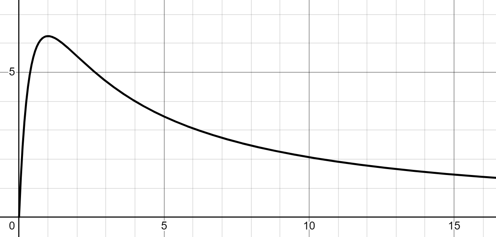

设电源电动势 $E$, 内阻 $r$,\
外电路电阻 $R$

电源输出功率 $P=UI$\
全电路欧姆定律 $\displaystyle I=\frac{E}{r+R}$\
端压 $\displaystyle U=E-Ir=E(1-\frac{r}{r+R})$

代入得

$$P=E^2(\frac{1}{r+R}-\frac{r}{(r+R)^2})$$

令 $\displaystyle t=\frac{1}{r+R}$, 有 $P=E^2(-rt^2+t)$\
显然二次函数开口朝下，在对称轴 $\displaystyle t=\frac{1}{2r}$ 处有最大值\
即

$$\boxed{R=r, P_{max}=\frac{E^2}{4r}}$$

有 $\displaystyle R=\frac{1}{t}-r$\
我们记 $\displaystyle P=P_0<\frac{E^2}{4r}$ 时对应的两个 $R$ 为 $R_{1,2}$\
故有

$$R_1R_2=\frac{1}{t_1t_2}-r(\frac{1}{t_1}+\frac{1}{t_2})+r^2=\frac{1-r(t_1+t_2)}{t_1t_2}+r^2$$

应用韦达定理有 $\displaystyle t_1+t_2=\frac{1}{r}$, 代入即得

$$\boxed{R_1R_2=r^2}$$

附一张 $E=5\mathrm{V}, r=1\Omega$ 时电源输出功率 $P$ 关于外电路电阻 $R$ 的函数图像

