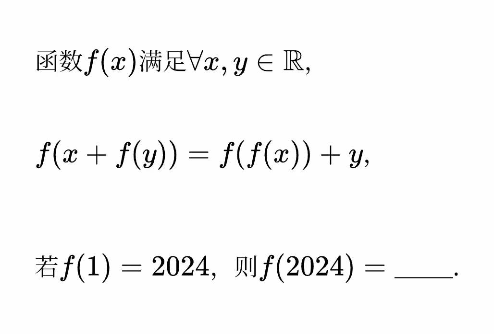

$$
\begin{aligned}
f(x+f(y))&=f(f(x))+y\\
&=f(0+f(x))+y\\
&=f(f(0))+x+y
\end{aligned}
$$

令 $t=x+f(y)$.
$f(t)=t-f(y)+f(f(0))+y$
设 $y$ 为常数，则 $-f(y)+f(f(0))+y$ 也是常数，设为 $C$.
即 $f(t)=t+C$.
由 $f(1)=1+C=2024$，得 $C=2023$.

因此 $f(2024)=2024+2023=4047$.
