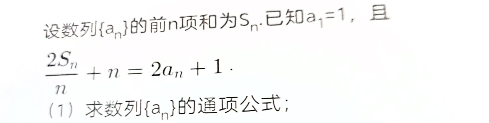

**解:**
等式化简:

$$
\begin{aligned}
2a_n+1&=n+\frac{2(a_n+S_{n-1})}{n}\\
2na_n+n&=n^2+2a_n+2S_{n-1}\\
(2n-2)a_n&=n^2-n+2S_{n-1}\\
a_n&=\frac{n}{2}+\frac{S_{n-1}}{n-1}
\end{aligned}
$$

得:

$$
\begin{aligned}
S_n&=a_n+S_{n-1}\\
&=\frac{n}{2}+(\frac{n}{n-1})S_{n-1}\ (S_n\text{递推式})\\
&=\frac{n}{2}+(\frac{n}{n-1})\left[\frac{n-1}{2}+(\frac{n-1}{n-2})S_{n-2}\right]\\
&=\frac{n}{2}+\frac{n}{2}+(\frac{n}{n-2})S_{n-2}\\
&=...\\
&=(n-1)(\frac{n}{2})+nS_1\\
&=\frac{n^2+n}{2}
\end{aligned}
$$

即:

$$
\begin{aligned}
a_n&=\frac{n}{2}+\frac{n^2+n}{2n-2}\\
&=\frac{2n^2}{2n-2}\\
&=\frac{n^2}{n-1}
\end{aligned}
$$
