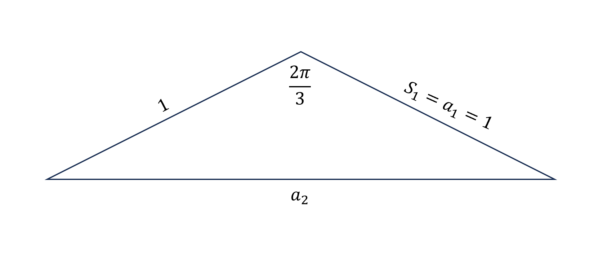
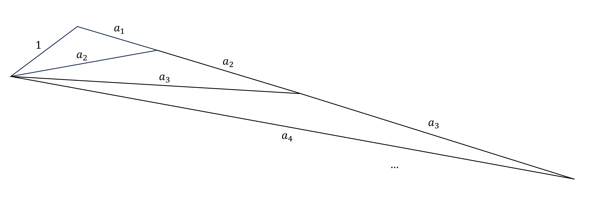

周日晚自习偶遇来自同学的野题，拼尽全力无法战胜。

野题不愧是野题，正解的路子十分野。

# 题目

已知一个数列 $\{a_n\}$, 前 $n$ 项和记为 $S_n$, 满足 $a_1=1, a_{n+1}=\sqrt{S_n^2+S_n+1}\ (n\in\mathbb{N}^*)$, 求 $a_n$

## 尝试

看见题目完全没有明确的思路

**初次尝试**：等式两边平方, 再代入 $n+1$, 两式作差试图找到一些递推式，失败告终。

**再次尝试**：分别计算了三项，试图瞪眼法寻找通项公式

$$a_2=\sqrt3,a_3=\sqrt{6+3\sqrt3},a_4=$$

不对啊这个 $a_4$ 简直是一大坨啊！？

**三次尝试**：放弃寻找优雅的转化方式, 直接求解二次方程

经过一系列化简和讨论, 终于得到一个看上去有些正常的数列递推式

$$a_{n+1}=\sqrt{2a_n^2+a_n\sqrt{4a_n^2-3}}$$

这真正常吗？这能整出通项？

然后出于好奇，用递推式计算了 $a_4$

$$a_4=\sqrt{12+6\sqrt3+\sqrt{234+135\sqrt3}}$$

看来刚才没有去计算 $a_4$ 是一个正确的选择。

之后又倒回去验算了几次尝试的中间步骤，最终放弃了，前去询问了这道野题的“正解”。

# 野路子正解

$$a_{n+1}^2=S_n^2+S_n+1$$

注意到, 上式可以写作

$$a_{n+1}^2=S_n^2+1^2-2S_n\cos\frac{2\pi}{3}$$

可见这是一个三角形的余弦定理, 三边分别为 $a_{n+1}$、$S_n$、$1$, 其中 $S_n$ 与 $1$ 两边的夹角为 $2\pi/3$.

我们代入 $n=1$, 于是 $S_1=a_1=1$, 我们画出一个三角形

再看到 $n=2$, 我们需要 $S_2$、$1$ 的两边与其夹角 $2\pi/3$, 显然把上图的 $S_1$ 延长为 $S_2=S_1+a_2$ 即可.

像这样持续构造下去，我们能在一张图中囊括数列 $\{a_n\}$

我们把三边为 $a_n$、$a_n$、$a_{n+1}$ 的等腰三角形的底角记为 $\theta_n$

由上图容易得到

$$\theta_n=\frac\pi{3\cdot2^n}$$

再对三边分别为 $a_{n+1}$、$S_n$、$1$ 的三角形应用正弦定理可得

$$\frac{\sin\theta_n}{1}=\frac{\sin\frac{2\pi}{3}}{a_{n+1}}$$

代入并化简可以得到

$$a_n=\frac{\sqrt3}{2\sin\frac\pi{3\cdot2^{n-1}}}$$

# 杂谈

如上, 我们将数列的问题转化到了一个几何问题, 经过优雅的构造图形, 将一个奇怪的数列置于相互联系的一串等腰三角形上, 又通过构造过程中使得图形所带有的性质, 求出了最终的通项。

由于这是一道野题, 所以其原题大概率是先给出了三角形的构造方式, 再倒回去求数列的一些东西。

我们常常碰到一些题目用常规方法做却毫无进展, 得知正解后发现是一些很有创造性又很有效的构造, 仅仅一步转化就使得题目变得十分容易。有种豁然开朗的感受。
